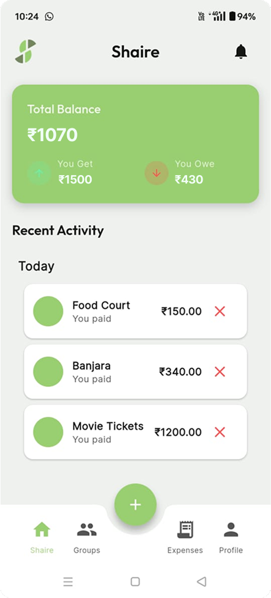
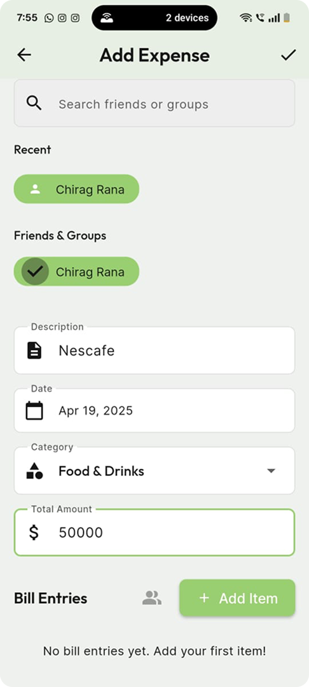

# 

A modern expense sharing and financial tracking application with AI-powered insights.

## About

Shaire is a comprehensive expense-sharing application designed to simplify group expenses, track personal finances, and provide AI-powered insights for better financial management. Split bills with friends, track group expenses, and visualize your spending patterns - all in one intuitive app.

## Key Features

### Core Features

- **Group Expense Management**: Create groups and track shared expenses
- **Friend-to-Friend Expense Sharing**: Split expenses between individuals
- **Receipt Scanning**: Capture receipts to automatically input expenses
- **Bill Itemization**: Split individual items on a bill among different people
- **Multiple Payment Methods**: Track payments through various methods
- **Balance Tracking**: See who owes what at a glance
- **Real-time Notifications**: Stay updated on expense activities

### AI/ML Features

- **Smart Receipt OCR**: Extract items, prices, and merchant details from receipt photos
- **Expense Categorization**: Automatically classify expenses based on descriptions
- **Predictive Spending Analysis**: ML models forecast future spending based on past patterns
- **Personalized Insights**: Get AI-generated insights about spending habits
- **Daily/Weekly/Monthly Predictions**: View forecasted expense amounts for upcoming periods
- **Category-based Spending Analysis**: See where your money goes with smart categorization

## Screenshots

<table>
  <tr>
  <td></td>
    <td></td>
    <td></td>
  </tr>
</table>

## Architecture

Shaire is built using:

- **Flutter**: Cross-platform UI framework using **Dart** programming Language.
- **Supabase**: Backend-as-a-Service for authentication, **PostgreSQL** database, and storage
- **Provider**: State management
- **Machine Learning**: Custom models trained using **TensorFlow** and **Scikit-Learn** for expense prediction and categorization
- **Gemini API**: For receipt processing and data extraction

## Data Model

The application uses a relational database with the following key entities:

- Users & Profiles
- Friendships
- Groups & Group Members
- Expenses & Expense Participants
- Payments
- Receipts
- Analytics & Predictions

## ML Model Architecture

Our machine learning features are powered by:

1. **Time Series Analysis**: For spending predictions
2. **Natural Language Processing**: For expense categorization based on descriptions
3. **Computer Vision**: For receipt processing and information extraction
4. **Clustering Algorithms**: For spending pattern analysis

## Getting Started

### Prerequisites

- Flutter SDK
- Supabase account
- Gemini API key

### Installation

1. Clone the repository:

```bash
git clone https://github.com/yourusername/shaire.git
cd shaire
```

2. Install dependencies:

```bash
flutter pub get
```

3. Configure environment variables for Supabase and Gemini API

4. Run the app:

```bash
flutter run
```

## Database Setup

Execute the SQL scripts in the `database` folder to create the necessary:

- Tables
- Stored procedures
- RLS policies
- Triggers

## Future Roadmap

- **Advanced ML Models**: Enhanced prediction accuracy
- **Budget Management**: Set and track spending limits
- **Debt Consolidation**: Simplify multiple debts between friends
- **Integration with Payment Services**: Direct settlement via payment apps
- **Social Features**: Comments and reactions on expenses

## Contributing

Contributions are welcome! Please feel free to submit a Pull Request.

## License

This project is licensed under the MIT License - see the LICENSE file for details.

## Acknowledgements

- [Flutter](https://flutter.dev/)
- [Supabase](https://supabase.io/)
- [TensorFlow](https://www.tensorflow.org/)

---

\*Made with ❤️ by Team **VCRAM\***
